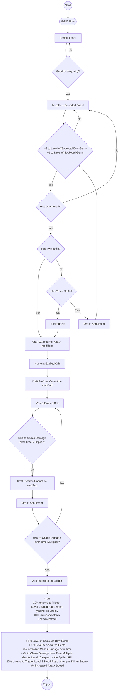

```mermaid
flowchart TD
    Start((Start)) --> A([ilvl 82 Bow])
    A --> B[Perfect Fossil]
    B --> C{Good base quality?}
    C --> |Yes| D[Metallic + Corroded Fossil]
    C --> |No| B
    D --> E{+2&nbsp;to&nbsp;Level&nbsp;of&nbsp;Socketed&nbsp;Bow&nbsp;Gems<br/>+1&nbsp;to&nbsp;Level&nbsp;of&nbsp;Socketed Gems}
    E --> |No| D
    E --> |Yes| F{Has Open Prefix?}
    F --> |No| D
    F --> |Yes| G{Has Two suffix?}
    G --> |Yes| J[Craft Cannot Roll Attack Modifiers]
    G --> |No| H{Has Three Suffix?}
    H --> |No| S[Exalted Orb]
    S --> J
    H --> |Yes| I[Orb of Annulment]
    I --> E
    J --> K[Hunter's Exalted Orb]
    K --> L[Craft Prefixes Cannot be modified]
    L --> M[Veiled Exalted Orb]
    M --> N{+#% to Chaos Damage over Time Multiplier?}
    N --> |No| O[Craft Prefixes Cannot be modified]
    O --> P[Orb of Annulment]
    P --> Q{+#% to Chaos Damage over Time Multiplier?}
    Q --> |Yes| R[Add Aspect of the Spider]
    Q --> |No| M
    R --> T["Craft <br/>10% chance to Trigger Level 1 Blood Rage when you Kill an Enemy<br/>10% increased Attack Speed (crafted)"]
    T --> U["<br/>+2&nbsp;to&nbsp;Level&nbsp;of&nbsp;Socketed&nbsp;Bow&nbsp;Gems<br/>+1 to Level of Socketed Gems<br/>#%&nbsp;increased&nbsp;Chaos&nbsp;Damage&nbsp;over&nbsp;Time<br/>+#%&nbsp;to&nbsp;Chaos&nbsp;Damage&nbsp;over&nbsp;Time&nbsp;Multiplier<br/>Grants Level 20 Aspect of the Spider Skill<br/>10%&nbsp;chance&nbsp;to&nbsp;Trigger&nbsp;Level&nbsp;1&nbsp;Blood&nbsp;Rage&nbsp;when&nbsp;you&nbsp;Kill&nbsp;an&nbsp;Enemy<br/>#%&nbsp;increased Attack Speed"]
    U --> End((Enjoy~))

```
