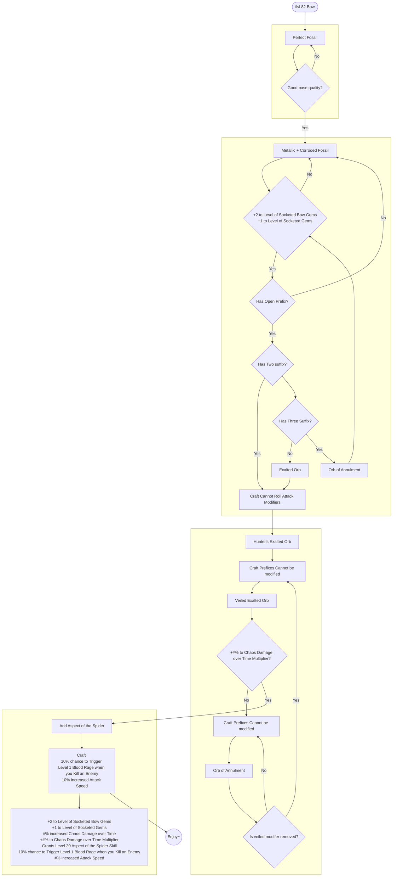

```mermaid
flowchart TD
    Start([ilvl 82 Bow]) --> perfect_fossil[Perfect Fossil]

    subgraph quality[" "]
      perfect_fossil --> quality_check{Good base quality?}
      quality_check --> |No| perfect_fossil
    end

   subgraph gem_modifiers[" "]
     quality_check --> |Yes| gem_fossils[Metallic + Corroded Fossil]
     gem_fossils --> gem_modifier_check{+2&nbsp;to&nbsp;Level&nbsp;of&nbsp;Socketed&nbsp;Bow&nbsp;Gems<br/>+1&nbsp;to&nbsp;Level&nbsp;of&nbsp;Socketed Gems}
     prefix_check --> |No| gem_fossils
     gem_modifier_check --> |No| gem_fossils
     gem_modifier_check --> |Yes| prefix_check{Has Open Prefix?}
     prefix_check --> |Yes| open_suffix_check{Has Two suffix?}
     open_suffix_check --> |Yes| no_attack[Craft Cannot Roll Attack Modifiers]
     open_suffix_check --> full_suffice_check{Has Three Suffix?}
     full_suffice_check --> |No| exalt_suffix[Exalted Orb]
     exalt_suffix --> no_attack
     full_suffice_check --> |Yes| annulment[Orb of Annulment]
     annulment --> gem_modifier_check
  end

  subgraph chaos_modifers[" "]
    no_attack --> hunter_orb[Hunter's Exalted Orb]
    hunter_orb --> lock_prefix[Craft Prefixes Cannot be modified]
    lock_prefix --> veil_orb[Veiled Exalted Orb]
    veil_orb --> chaos_dot{+#% to Chaos Damage over Time Multiplier?}
    chaos_dot --> |No| lock_prefix_correction[Craft Prefixes Cannot be modified]
    lock_prefix_correction --> annul_veiled[Orb of Annulment]
    annul_veiled --> veiled_removed{Is veiled modifer removed?}
    veiled_removed --> |Yes| lock_prefix
    veiled_removed --> |No| lock_prefix_correction
  end

  subgraph spider_and_craft[" "]
    chaos_dot --> |Yes| spider_aspect[Add Aspect of the Spider]
    spider_aspect --> trigger["Craft <br/>10% chance to Trigger Level 1 Blood Rage when you Kill an Enemy<br/>10% increased Attack Speed"]
    trigger --> result["<br/>+2&nbsp;to&nbsp;Level&nbsp;of&nbsp;Socketed&nbsp;Bow&nbsp;Gems<br/>+1 to Level of Socketed Gems<br/>#%&nbsp;increased&nbsp;Chaos&nbsp;Damage&nbsp;over&nbsp;Time<br/>+#%&nbsp;to&nbsp;Chaos&nbsp;Damage&nbsp;over&nbsp;Time&nbsp;Multiplier<br/>Grants Level 20 Aspect of the Spider Skill<br/>10%&nbsp;chance&nbsp;to&nbsp;Trigger&nbsp;Level&nbsp;1&nbsp;Blood&nbsp;Rage&nbsp;when&nbsp;you&nbsp;Kill&nbsp;an&nbsp;Enemy<br/>#%&nbsp;increased Attack Speed"]
  end

  trigger --> End((Enjoy~))
```
