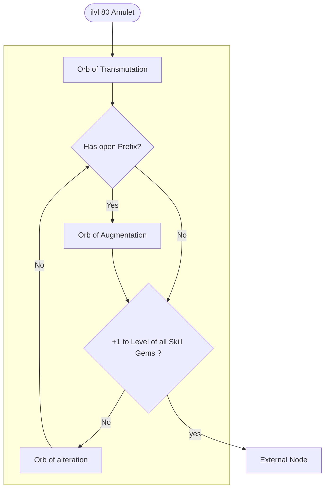

```mermaid
flowchart TD
  start([ilvl 80 Amulet]) --> transmutation
  subgraph alt_spam[" "]
    transmutation["Orb of Transmutation"] --> open_prefix{Has open Prefix?}
    open_prefix --> |Yes| augmentation["Orb of Augmentation"]
    open_prefix --> |No| magic_prefix_check{+1 to Level of all Skill Gems ?}
    augmentation --> magic_prefix_check
    magic_prefix_check --> |No| alteration["Orb of alteration"]
    alteration --> |No| open_prefix
  end

magic_prefix_check --> |yes| external_node["External Node"]
```
