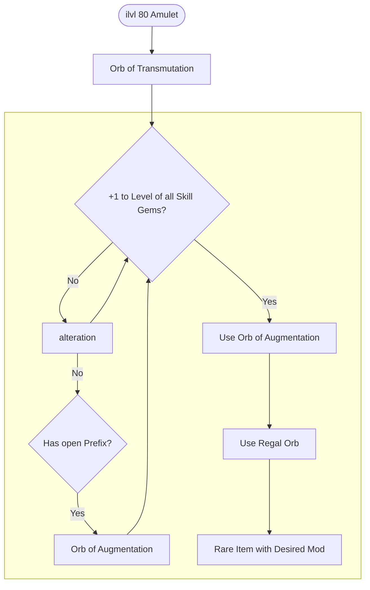

```mermaid
flowchart TD
    start([ilvl 80 Amulet]) --> transmutation[Orb of Transmutation]
    transmutation --> check

    subgraph alt_spam[" "]
    direction TB
      alteration --> check{+1 to Level of all Skill Gems?}
      alteration --> |No| open_magic_prefix{Has open Prefix?}
      open_magic_prefix --> |Yes| augmentation[Orb of Augmentation]
      augmentation --> check
      check --> |No| alteration
      check --> |Yes| augment[Use Orb of Augmentation]
      augment --> regal[Use Regal Orb]
      regal --> result[Rare Item with Desired Mod]
    end
```
